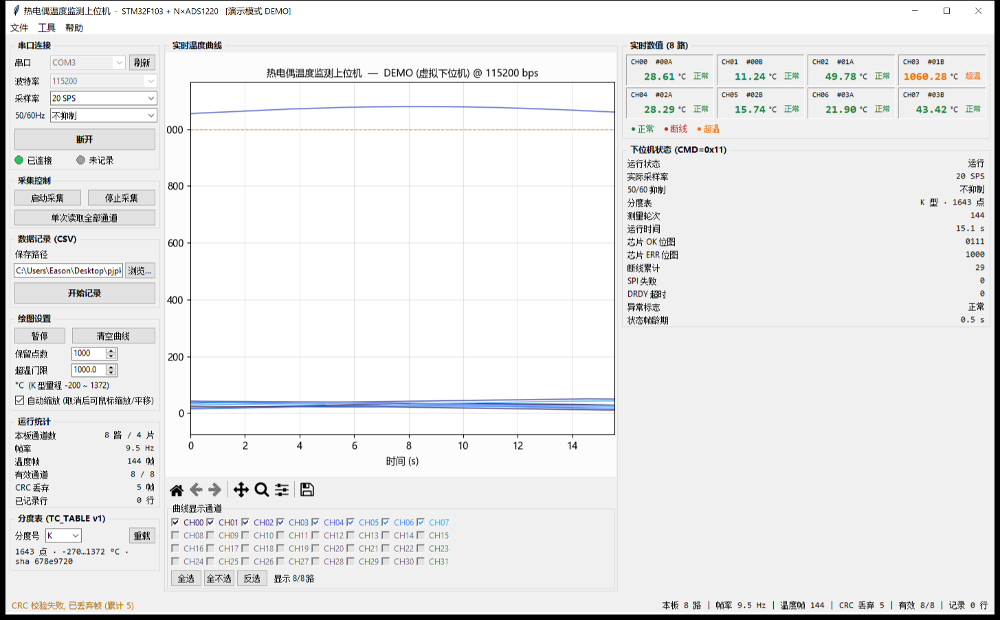

# 热电偶测温系统 —— 上位机 (PC) 软件

STM32F103 + N×ADS1220 K 型热电偶实时监测上位机。
Tkinter 界面 · Matplotlib 实时曲线 · PySerial 串口线程 · Pandas CSV 记录。

> ⚠️ 关于文件名：工程根目录已存在固件说明文档 `ReadMe.md`。
> Windows/macOS 文件系统大小写不敏感，`README.md` 会覆盖它，
> 因此本上位机说明放在 `pc_ui/README.md`（内容即本文）。



> 截图是**演示模式**下的 8 路板（4 片 ADS1220）：只显示真实存在的 CH00–CH07，
> 其余通道直接置灰；CH03 演示超温、CH07 演示断线；
> 右下状态栏的"芯片 OK/ERR 位图"能直接看出第 4 片没焊。

---

## 0. 支持 4 / 8 / 16 / 32 路，同一份软件

| 板子 | 固件 `ADS1220_CHIP_COUNT` | 上位机显示 |
| --- | --- | --- |
| 2 片 = 4 路（先贴 2 片验证） | `2` | CH00–CH03 |
| 4 片 = 8 路（默认） | `4` | CH00–CH07 |
| 8 片 = 16 路 | `8` | CH00–CH15 |
| 16 片 = 32 路（老版本） | `16` | CH00–CH31 |

**上位机不需要任何设置**：固件在状态帧里上报"本板片数"，软件据此自动只显示真实
存在的通道，其余勾选框置灰、曲线不画、也不会计入"有效通道"。

想手动覆盖（比如固件没上报片数）就用 `--channels 8`。

> 硬件设计（引脚分配表、要不要四层板、ADS1220 外围清单、踩坑提醒）见
> [`docs/HARDWARE_8CH.md`](../docs/HARDWARE_8CH.md)。

---

## 1. 快速开始

```bash
# 1) 安装依赖 (tkinter 是 Python 标准库, 无需 pip 安装)
pip install -r requirements.txt

# 2) 无硬件先看界面 (内置虚拟下位机, 数据全链路走真实协议帧)
python pc_ui/main.py --demo

# 3) 连接真实设备
python pc_ui/main.py -p COM3                 # 115200 (默认)
python pc_ui/main.py -p COM3 -b 460800       # 600 SPS 高速采样建议 460800
python pc_ui/main.py --list-ports            # 只列出串口
python pc_ui/main.py --selftest              # 协议自检, 不开窗口

# 也可以按模块运行
python -m pc_ui --demo
```

### 命令行参数

| 参数 | 说明 |
| --- | --- |
| `-p, --port COM3` | 串口名 (`/dev/ttyUSB0` 亦可) |
| `-b, --baud {115200,460800}` | 波特率，默认 115200 |
| `--demo` | 演示模式：用 `DemoSource` 虚拟下位机产生数据 |
| `--samples N` | 曲线保留点数，默认 1000 |
| `--channels N` | 强制本板通道数（4/8/16/32）；默认 0 = 自动跟随固件上报的片数 |
| `--tc-type X` | 分度号，默认 **K**；需 `tables/tc_type_<x>.csv` 已存在 |
| `--data-dir DIR` | CSV 默认目录，默认 `./data` |
| `--over-temp T` | 超温门限 °C，默认 1000 |
| `--no-auto-connect` | 启动后不自动连接 |
| `--list-ports` | 列出串口后退出 |
| `--selftest` | 运行协议自检后退出 |

### 分度表 (TC_TABLE v1)

工程 `tables/` 目录下自带 **K / J / T / E / N** 五种分度表，由 NIST SRD 60 官方
纯文本数据自动生成并逐点校验，**默认使用 K 型**。

| 命令 | 作用 |
| --- | --- |
| `python tools/nist_tc_tables.py` | 重新下载/生成/校验全部表（带本地缓存，可 `--offline`）|
| `python pc_ui/table_selftest.py` | 表与引擎自检（44 项：往返、亚格点精度、scipy 交叉验证、单位/篡改防护）|
| `python -m pc_ui.tc_table J` | 命令行试算某张表 |

表文件的字段、校验规则、以及"怎么把厂家 PDF 变成这个格式"的流程，
见 **[docs/TC_TABLE_FORMAT.md](../docs/TC_TABLE_FORMAT.md)**。

> ⚠️ 单位是强制字段：NIST 原文件的逆函数系数是 **mV** 基准，而固件是 **µV** 基准，
> 两者差 `1000^(i-1)`。抄错不会报错，只会让温度差几个数量级 —— 所以加载器
> 强制校验 `emf_unit`，并且用 `sha256` 防止表被手改。

---

## 2. 文件结构

```
pc_ui/
├── protocol.py       协议层: CRC-16/MODBUS、组帧、拆帧状态机、上下行命令/解析 (无 GUI 依赖)
├── serial_reader.py  串口线程 SerialReader: 独占串口, 收帧进 queue, 断线自动重连
├── recorder.py       记录线程 DataRecorder: Pandas 后台批量追加写 CSV
├── simulator.py      虚拟下位机 DemoSource: 先组真实字节帧再走拆帧解析
├── widgets.py        自定义控件: RingBuffer / StatusLamp / ChannelGrid / ChannelSelector
├── app.py            主窗口 TemperatureApp: 排版 + 100ms 定时刷新
├── main.py           命令行入口 (argparse)
├── selftest.py       无界面自检 (协议 + 缓冲 + 记录 + 线程 + 演示源)
├── gui_selftest.py   界面集成自检 (真的拉起窗口, 模拟点击, 验证 CSV 落盘)
└── README.md         本文件
```

工程根目录另有 `host_parser.py`（固件作者提供的命令行协议工具），
与 `pc_ui/protocol.py` 使用**完全相同的协议规则**，两者可互相验证：

```bash
python host_parser.py --test          # 命令行版协议自检
python pc_ui/main.py --selftest       # 上位机版协议自检
```

---

## 3. 界面说明

```
+----------------+---------------------------+------------------+
|  左侧控制面板  |      中部实时曲线         |   右侧数值面板   |
|  串口/采样率   |  32 路曲线 + 通道勾选     |  32 路温度网格   |
|  记录/绘图参数 |  工具栏(缩放/平移/保存)   |  下位机状态详情  |
+----------------+---------------------------+------------------+
|                    底部状态栏 (消息 + 计数)                     |
+--------------------------------------------------------------+
```

* **左侧**：串口下拉（自动扫描 + `刷新`/F5）、波特率、采样率、50/60Hz 抑制、
  连接/断开、启动/停止采集、单次读取、保存路径、开始/停止记录、
  暂停/清空、保留点数、超温门限、自动缩放、运行统计、两盏状态灯。
* **中部**：Matplotlib 实时曲线（X 轴为会话内秒数，Y 轴 °C），
  超温门限虚线参考线，下方 32 个彩色勾选框控制显示/隐藏（全选/全不选/反选）。
* **右侧**：4×8 网格显示 32 路的 `通道号 / 温度 / 状态(正常/断线/超温)`，
  下方为下位机状态帧详情（芯片 OK/ERR 位图、断线累计、轮次等）。

### 快捷键

| 快捷键 | 功能 |
| --- | --- |
| `Ctrl+R` | 开始/停止记录 |
| `Ctrl+P` | 暂停/继续曲线 |
| `Ctrl+L` | 打开运行日志窗口 |
| `F5` | 刷新串口列表 |

### 状态灯

| 灯 | 颜色 | 含义 |
| --- | --- | --- |
| 连接 | 灰 / 绿 / 黄 / 红 | 未连接 / 已连接 / 重连中 / 已断开 |
| 记录 | 灰 / 红闪烁 | 未记录 / 正在写盘（数字为已写行数）|

每个通道的状态判定：

* `断线`：该路温度为 NaN（固件判定热电偶开路/超量程/通信失败）；
* `超温`：温度 > 超温门限（默认 1000 °C，可改）；
* `正常`：其余情况。

---

## 4. 通信协议（与固件 `Core/Inc/uart_protocol.h` 完全一致）

```
上位机 -> STM32 :  AA  CMD  LEN  DATA...  CRC_LO  CRC_HI
STM32 -> 上位机 :  55  CMD  LEN  DATA...  CRC_LO  CRC_HI
```

* `LEN` = DATA 字节数（≤200）
* `CRC` = **CRC-16/MODBUS**（poly 0xA001 反射，init 0xFFFF），覆盖帧头→最后一个 DATA 字节，**低字节在前**
  标准向量：`crc16(b"123456789") == 0x4B37`

| 方向 | CMD | 含义 | DATA |
| --- | --- | --- | --- |
| 上行 | `0x10` | 温度（**固定 32 槽**） | 32 × float32 小端（°C）；无效/未接通道 = NaN (`0x7FC00000`) |
| 上行 | `0x11` | 状态 | 24 字节：运行状态/DR/抑制+本板片数/芯片 OK 位图/ERR 位图/轮次/运行时间/断线累计/标志… |
| 下行 | `0x01` | 设置采样率 | `[DR索引, 抑制索引]`，DR: 0=20 1=45 2=90 3=175 4=330 5=600 6=1000 SPS |
| 下行 | `0x02` | 启动/停止采集 | `[1 启动 / 0 停止]` |
| 下行 | `0x03` | 单次读取 | 省略或 `[0xFF 全部 / 0..31 指定通道]` |

通道顺序：`ch[2n]` = 第 n 片 ADS1220 的 AIN0/AIN1，`ch[2n+1]` = 该片 AIN2/AIN3。

**温度帧永远是 32 槽**，与板子实际通道数无关 —— 4 路板 / 8 路板 / 16 路板
共用同一套协议和同一份上位机，没接的槽位填 NaN。

**状态帧 byte2 的低 4 位 = 本板片数**（高 4 位仍是 50/60 抑制，老上位机只读高 4 位，
所以完全向后兼容）。老固件该字段为 0 时，上位机会退化成"按芯片 OK|ERR 位图推断"。

**状态帧 flags 位**（byte21）：

| 位 | 含义 |
| --- | --- |
| `0x01` | 上电自检失败（热电偶多项式） |
| `0x02` | DRDY 静默（长时间没有任何片就绪） |
| `0x04` | 上电回读校验不通过（有片没焊/虚焊） |
| `0x08` | 串口发送缓冲溢出（丢过帧） |
| `0x10` | 收到过 CRC 错的下行帧 |
| `0x20` | **有片一直不就绪**（看 chip_err 位图定位是哪片） |

**采样率与波特率**：一帧温度 133 字节，115200bps 下约 11.5ms/帧，
因此 175 SPS 及以上建议切到 460800（界面会给出提示）。

**50/60Hz 抑制**：按 ADS1220 手册只能配合 20 SPS 使用；
选了其它速率还带抑制时，固件会自动关掉并在状态帧里回读，界面也会提示。

---

## 5. 架构与线程模型（UI 永不阻塞）

```
   ┌──────────────────┐   bytes    ┌───────────────────────────┐
   │ 串口线程          │ ─────────► │ FrameParser 拆帧 + CRC 校验│
   │ SerialReader      │            └───────────┬───────────────┘
   │ (独占串口读写)    │ ◄── 下行命令队列 ◄──┐   │ dict 消息
   └──────────────────┘                     │   ▼
                                    ┌───────────────────────────┐
        ┌───────────────────────────┤  queue.Queue (线程安全)    │
        │                           └───────────┬───────────────┘
        │ 命令(立即返回, 排队发送)               │
   ┌────┴───────────────────────────────────────▼───────────────┐
   │                    UI 线程 (Tkinter)                        │
   │  root.after(100ms): 取队列 → 更新曲线/数值/状态灯/计数       │
   └────┬───────────────────────────────────────────────────────┘
        │ submit(t, temps) 只入队, 立刻返回
        ▼
   ┌───────────────────────────┐
   │ 记录线程 DataRecorder      │  攒够 64 行或 1s → Pandas 追加写 CSV
   └───────────────────────────┘
```

* 串口读写全部在 `SerialReader` 线程内完成；UI 只往发送队列里放字节，**不会等待串口**。
* 记录线程独立；磁盘慢/满只影响 `last_error` 与丢弃计数，不拖慢采集与界面。
* CRC 校验失败的帧由拆帧状态机直接丢弃（绝不输出错误数据），只累计计数并提示。
* 帧内字节间隔 >50ms 判定为半截帧，自动丢弃并重新找帧头（与固件的 `UART_FRAME_GAP_MS` 对应）。
* 串口掉线（USB 拔出等）自动重连，间隔 1s，界面状态灯转为"重连中"。
* 超过 3s 收不到温度帧会在状态栏给出红色警告。

---

## 6. 数据记录

点击 `开始记录` 后，在所选目录生成两个文件（同一时间戳，便于配对）：

```
temperature_YYYYMMDD_HHMMSS.csv      # 温度主数据
status_YYYYMMDD_HHMMSS.csv           # 下位机状态帧
```

温度 CSV 列：

| 列 | 说明 |
| --- | --- |
| `iso_time` | 本地时间（毫秒精度） |
| `unix_ts` | Unix 时间戳（秒） |
| `elapsed_s` | 相对记录开始的秒数 |
| `valid_count` | 本行有效通道数 |
| `ch00 … ch31` | 32 路温度 °C，**断线为 NaN（写为 `NaN`）** |

状态 CSV 列：`iso_time, unix_ts, elapsed_s, run, dr_sps, reject, chip_ok, chip_err,
rounds, uptime_ms, drdy_cnt, spi_err, open_cnt, timeout_cnt, flags, flag_text`

用 Pandas 快速分析：

```python
import pandas as pd
df = pd.read_csv("data/temperature_20240521_101500.csv", parse_dates=["iso_time"])
print(df[["ch00", "ch01"]].describe())
df.set_index("elapsed_s")[["ch00", "ch03"]].plot()      # 直接画图
print("断线比例:", df["ch07"].isna().mean())
```

> 记录参数：每 64 行或每 1 秒批量落盘一次（掉电最多丢 1 秒数据）；
> 若写盘队列溢出会丢弃最旧的行并计数，状态栏会提示"队列溢出丢弃 N 行"。

---

## 7. 自检与测试

```bash
python pc_ui/selftest.py         # 33 项: 协议/CRC/抗干扰/环形缓冲/CSV/线程/演示源
python pc_ui/gui_selftest.py     # 31 项: 真实拉窗口, 模拟点击, 验证 CSV 落盘 (会短暂弹窗)
python pc_ui/main.py --selftest  # 只跑协议自检
```

`gui_selftest.py` 覆盖：连接演示下位机 → 收帧/画曲线/更新数值 → 切换采样率与抑制并回读 →
停止/启动采集 → 单次读取 → 暂停/通道勾选/保留点数/超温门限 → 开始/停止记录并核对 CSV 行数列名。

设置环境变量 `TC_KEEP_TMP=1` 可保留自检生成的 CSV 以便排查。

---

## 8. 常见问题

| 现象 | 排查 |
| --- | --- |
| 串口列表为空 | 装好 USB-TTL 驱动；点 `刷新`；Linux 下确认用户在 `dialout` 组 |
| 连上但一直"等待数据" | 下位机是否已启动采集（界面会自动发 `CMD=0x02`）；波特率是否与固件一致 |
| 状态栏报 CRC 丢弃 | 波特率不匹配 / 线太长 / 未共地 / 高速率未用 460800 |
| 通道一直显示"断线" | 热电偶开路、接线端子松动，或该片 ADS1220 通信失败（看右侧芯片 ERR 位图）|
| 采样率切不上去 | 抑制只在 20SPS 有效；600SPS 需 460800bps |
| 曲线很卡 | 降低"保留点数"，或减少勾选的通道数；暂停曲线不影响记录 |
| 中文显示成方框 | 安装 `Microsoft YaHei`/`SimHei`，或在 `app.py` 顶部改用本机中文字体 |

---

## 9. 依赖

```
pyserial>=3.5
matplotlib>=3.6
pandas>=1.5
numpy>=1.23
```

`tkinter` 随 Python 官方安装包提供；Linux 下若缺失：`sudo apt install python3-tk`。
